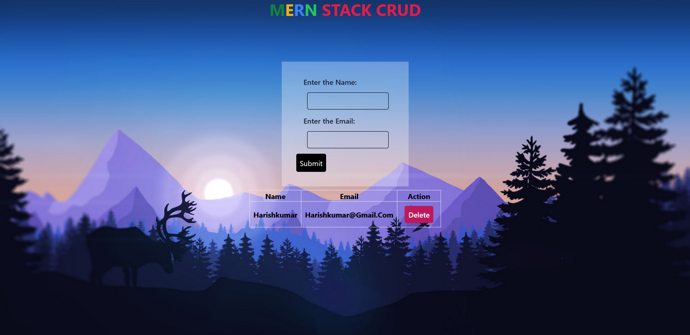

# MERN Stack Application with CRUD Operations



## Overview

This is a simple MERN stack application that demonstrates CRUD operations. The application includes the following components:

- MongoDB: Database for storing data.
- Express.js: Backend framework for handling server-side logic.
- React: Frontend library for building user interfaces.
- Node.js: Runtime environment for running server-side JavaScript.

## Setup

1. **Clone the Repository:**
   ```bash
   git clone 
   cd your-mern-app
